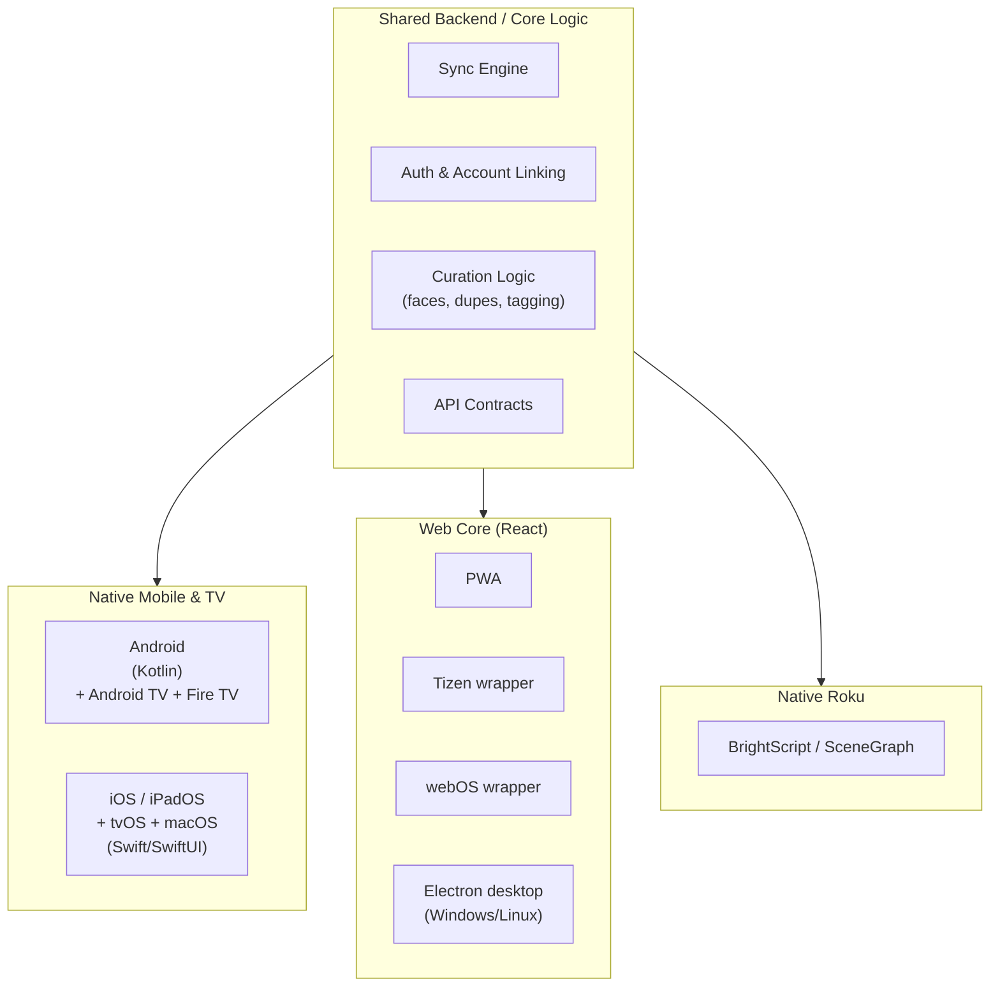
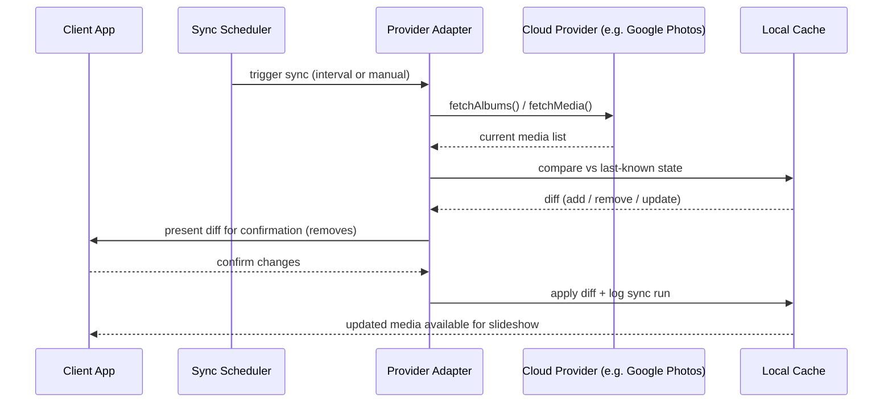

# Architecture Diagrams

These are written as [Mermaid](https://mermaid.js.org/) code blocks, so they
render directly in the docs and stay version-controlled as text rather than
going stale as external images.

## High-level cross-platform architecture

## Sync engine flow

## Phased platform rollout

```mermaid
gantt
    title Phased Platform Rollout (relative sequencing, not fixed dates)
    dateFormat  X
    axisFormat %s
    section Phase 1
    Android phone + Android TV      :p1, 0, 3
    section Phase 2
    Fire TV                          :p2, after p1, 1
    section Phase 3
    iOS + tvOS                       :p3, after p2, 3
    section Phase 4
    PWA / Web core                   :p4, after p3, 2
    section Phase 5
    Samsung Tizen + LG webOS         :p5, after p4, 2
    section Phase 6
    Roku                             :p6, after p5, 2
    section Phase 7
    Windows/Linux desktop (Electron) :p7, after p6, 1
```

:::tip Keep these updated
Edit these diagrams directly in this markdown file as decisions change —
no separate diagramming tool needed, and the diff shows up cleanly in git
history.
:::
