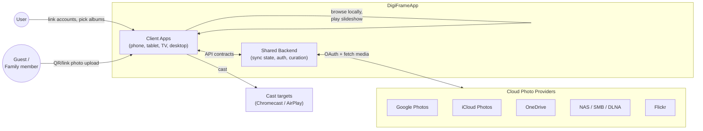
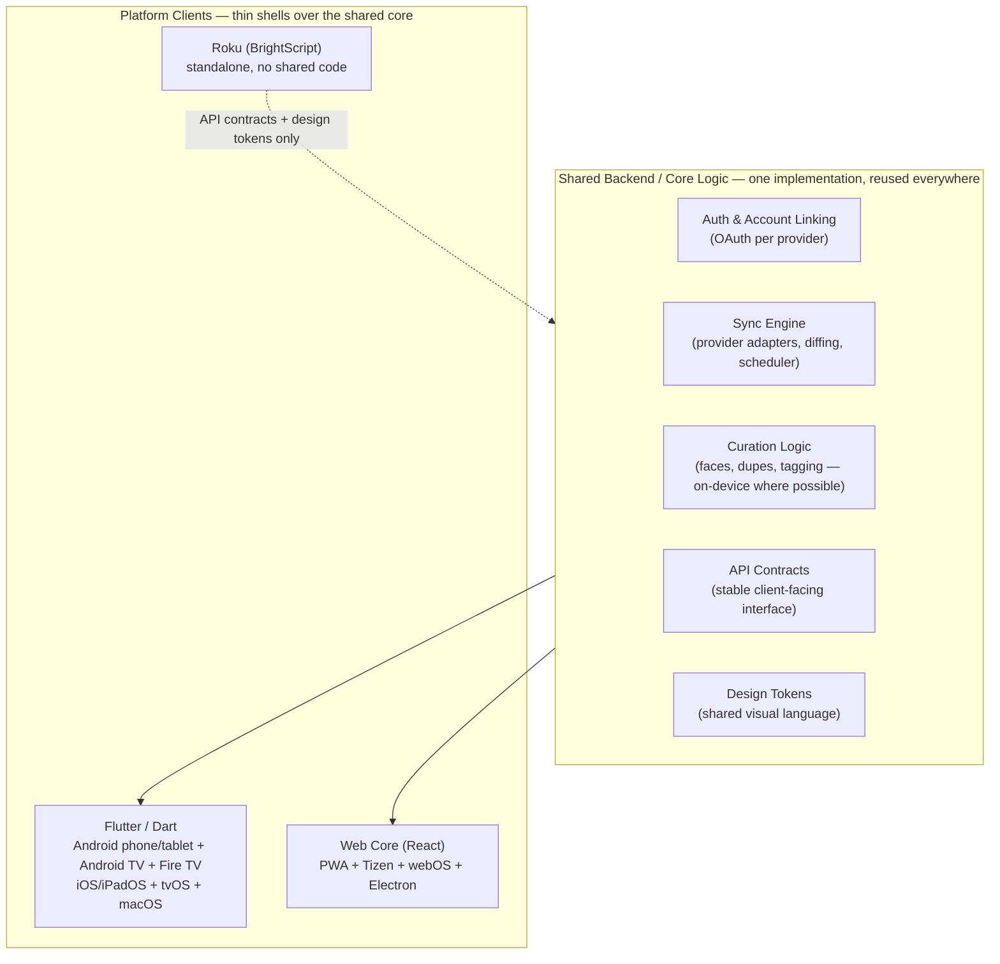

# High-Level Design

This page consolidates the product, architecture, and platform decisions
scattered across the other docs into a single system-level view. Treat the
other Architecture pages ([Shared Backend](/architecture/shared-backend),
[Sync Engine](/architecture/sync-engine), [Diagrams](/architecture/diagrams))
as the detailed drill-down for the pieces summarized here.

## 1. Purpose & scope

DigiFrameApp turns a user's existing cloud photo libraries (Google Photos,
iCloud, OneDrive, NAS/SMB, Flickr) or local device storage into a slideshow
that plays on phones, tablets, TVs, dedicated photo frames, and digital
signage displays. See [Product Vision](/overview/product-vision) for the
full concept and differentiators.

This is a **display and curation** product, not a photo editor, and not a
storage provider — original photos always live in the source provider; the
app syncs, caches, and renders them.

### Design pillars (drive every decision below)

1. **Sync you can trust** — transparent, non-destructive, resumable. The
   reference app's #1 complaint is silent, unexplained sync breakage; this
   is the wedge (see [Reliability & Trust](/features/reliability-trust)).
2. **One app, many providers** — the reference app ships a separate app per
   cloud provider; we support multiple providers, including simultaneous
   Google Photos + iCloud, in a single app.
3. **Real backend, not thin-client-only** — [competitor teardown](/overview/competitor-teardown)
   shows the reference app has no authoritative server-side sync state.
   Owning that state server-side is a structural advantage, not just extra
   complexity.
4. **Shared core, thin platform shells** — Flutter/Dart is one shared
   codebase across the entire Android *and* Apple ecosystems (business logic
   and most UI), not just within each ecosystem separately; Web/PWA stays a
   separate React core (a better fit for Tizen/webOS's native web runtimes —
   see [Smart TV & Web](/platforms/smart-tv-web)); Roku remains fully
   standalone. D-pad/focus navigation, casting APIs, and store-specific glue
   are still per-platform regardless of framework.

## 2. System context

The backend never stores original photo bytes long-term — it holds sync
state, diffs, tokens, and thumbnails/metadata needed for cross-device
consistency and offline caching. Source of truth for the actual images
remains the provider.

## 3. High-level architecture

Two implementations of the shared core exist in practice — one shared
Flutter/Dart codebase covering Android and Apple, one React/Web core for
the PWA (and its Tizen/webOS/Electron wrappers) — behind the same API
contracts, plus a fully standalone Roku build. See
[Shared Backend](/architecture/shared-backend) for what is and isn't
reusable across platforms, and why (D-pad/focus navigation and store
compliance are inherently per-platform).

## 4. Core components

| Component | Responsibility | Detail page |
|---|---|---|
| **Provider adapters** | One per source, each implementing a common `MediaProvider` interface written once in Dart (see [Portability note](/architecture/media-provider-abstraction#portability-note)); Phase 1 ships local storage + USB only, with cloud providers (Google Photos, iCloud, OneDrive, NAS/SMB, Flickr, Immich) as future adapters | [Media Provider Abstraction](/architecture/media-provider-abstraction) |
| **Diffing layer** | Compares last-known vs. current provider state into an explicit add/remove/update change set; never auto-applies removes | [Sync Engine](/architecture/sync-engine) |
| **Sync scheduler** | Triggers periodic sync (`WorkManager` / background tasks / service worker), tunable per user (interval, Wi-Fi-only) | [Sync Engine](/architecture/sync-engine) |
| **Local cache** | Drift/SQLite (Flutter clients) or IndexedDB (Web): thumbnails + metadata per device, enabling offline slideshow playback | [Sync Engine](/architecture/sync-engine) |
| **Sync log** | Human-readable history of sync runs, surfaced in-app for transparency | [Reliability & Trust](/features/reliability-trust) |
| **Curation engine** | Face grouping, duplicate/blur detection, auto-tagging/scene detection — on-device for privacy | [Smart Curation](/features/smart-curation) |
| **Slideshow engine** | Playback: transitions, timing, fill/letterbox modes, video/GIF, overlays, Ken Burns, music sync | [Slideshow Engine](/features/slideshow-engine) |
| **Casting layer** | Google Cast SDK (Chromecast) / AirPlay (Apple); platform-native, not shared | [Android](/platforms/android), [Apple](/platforms/ios-tvos) |
| **Sharing/guest ingest** | QR/link-based remote upload from family/guests into a shared album | [Sharing & Collaboration](/features/sharing-collaboration) |

## 5. Key data flows

### 5.1 Sync flow

The highest-priority flow to get right, given the reliability wedge. Full
sequence diagram in [Architecture Diagrams](/architecture/diagrams).

1. Scheduler triggers a sync (interval or manual "force full re-sync").
2. Provider adapter calls `fetchAlbums()`/`fetchMedia()` against the source.
3. Result is diffed against last-known local state → explicit add/remove/update set.
4. Removals are **never applied silently** — surfaced to the user for confirmation, with a local backup + undo window before anything is deleted.
5. Confirmed diff is applied to the local cache and appended to the sync log.
6. Updated media becomes available to the slideshow engine, including offline.

### 5.2 Slideshow playback flow

Client reads from local cache (not live from provider) → slideshow engine
applies curation filters (e.g., "just Mom", exclude blurry/dupes) → renders
with configured transitions/overlays → optionally casts to Chromecast/AirPlay
or drives an embedded LAN webserver for smart-TV/DLNA targets (pattern
observed in the [competitor teardown](/overview/competitor-teardown), worth
evaluating as a lower-latency alternative to standard casting).

### 5.3 Sharing / guest-upload flow

Guest scans a QR code or opens a link → uploads a photo without needing the
full app/account → backend attaches it to the target shared album → next
sync cycle (or a push) surfaces it on the display, live for event use cases
(wedding/party guest photos).

## 6. Platform strategy

| Ecosystem | Codebase | Covers | Shares core with |
|---|---|---|---|
| Android + Apple | Flutter/Dart | Android phone/tablet, Android TV, Fire TV, iOS/iPadOS, tvOS, macOS | Single shared codebase across both ecosystems; TV focus-engine UI (Android TV/Fire TV vs. tvOS) still needs per-platform handling |
| Web | React | PWA (source of truth UI), Samsung Tizen, LG webOS, Electron (Windows/Linux) | Tizen/webOS/Electron are thin wrappers over the PWA core |
| Roku | BrightScript/SceneGraph | Roku channel | None — fully standalone, reuses only API contracts + design tokens |

Not shareable across any of the above, by design: D-pad/remote/focus
navigation, store submission/compliance, and native casting APIs (Cast SDK
vs. AirPlay vs. built-in smart-TV display APIs). See
[Shared Backend](/architecture/shared-backend) for the full rationale and
the resulting team/skill implication (Dart/Flutter, Web/JS + a standalone
Roku effort).

## 7. Phased rollout

Platforms are built in dependency order so later phases reuse earlier
investment rather than duplicating it (e.g., the Web core in Phase 4 is
deliberately built *after* native apps so Phases 5–7 can wrap it).

```mermaid
gantt
    title Phased Platform Rollout (relative sequencing, not fixed dates)
    dateFormat  X
    axisFormat %s
    section Phase 1
    Android phone + Android TV      :p1, 0, 3
    section Phase 2
    Fire TV                          :p2, after p1, 1
    section Phase 3
    iOS + tvOS                       :p3, after p2, 3
    section Phase 4
    PWA / Web core                   :p4, after p3, 2
    section Phase 5
    Samsung Tizen + LG webOS         :p5, after p4, 2
    section Phase 6
    Roku                             :p6, after p5, 2
    section Phase 7
    Windows/Linux desktop (Electron) :p7, after p6, 1
```

Phase 1 goal: local device + USB photo playback (MediaStore + Storage
Access Framework), sequential-playback slideshow, one Flutter/Dart
codebase covering Android phone and Android TV — no cloud provider yet.
Google Photos OAuth + Picker integration lands in Phase 2 alongside Fire
TV. See [Roadmap](/roadmap/phase-1-android) for the full phase breakdown.

## 8. Non-functional requirements

- **Reliability** — sync must be resumable (interrupted runs never
  duplicate/lose items) and non-destructive by default; this is the
  product's core differentiator, not a nice-to-have.
- **Transparency** — every sync run is inspectable (what changed, when,
  why) via the sync log.
- **Offline playback** — the slideshow must run from local cache without
  network access once media is synced.
- **Privacy** — face grouping and scene detection run on-device where
  possible, reflected in data-safety disclosures ([Smart Curation](/features/smart-curation)).
- **Provider abstraction** — no provider-specific logic outside the adapter
  layer; the rest of the app is provider-agnostic.

## 9. Open questions / risks carried forward

- Google Photos Library API's scoped/Picker-only access model may limit
  full-library sync — validate before finalizing the diffing/caching design
  (root-cause candidate for the reference app's sync complaints).
- iCloud Photos third-party access model needs confirmation — core to the
  "combine Google + iCloud in one app" differentiator.
- Default/configurable sync interval per provider is undecided.
- Whether an embedded local (LAN) webserver is worth building for
  lower-latency smart-TV/DLNA casting, vs. relying solely on Cast/AirPlay.

Full per-area open-question lists live on their respective pages
([Sync Engine](/architecture/sync-engine), [Android](/platforms/android),
[Apple](/platforms/ios-tvos), [Roku](/platforms/roku)).
